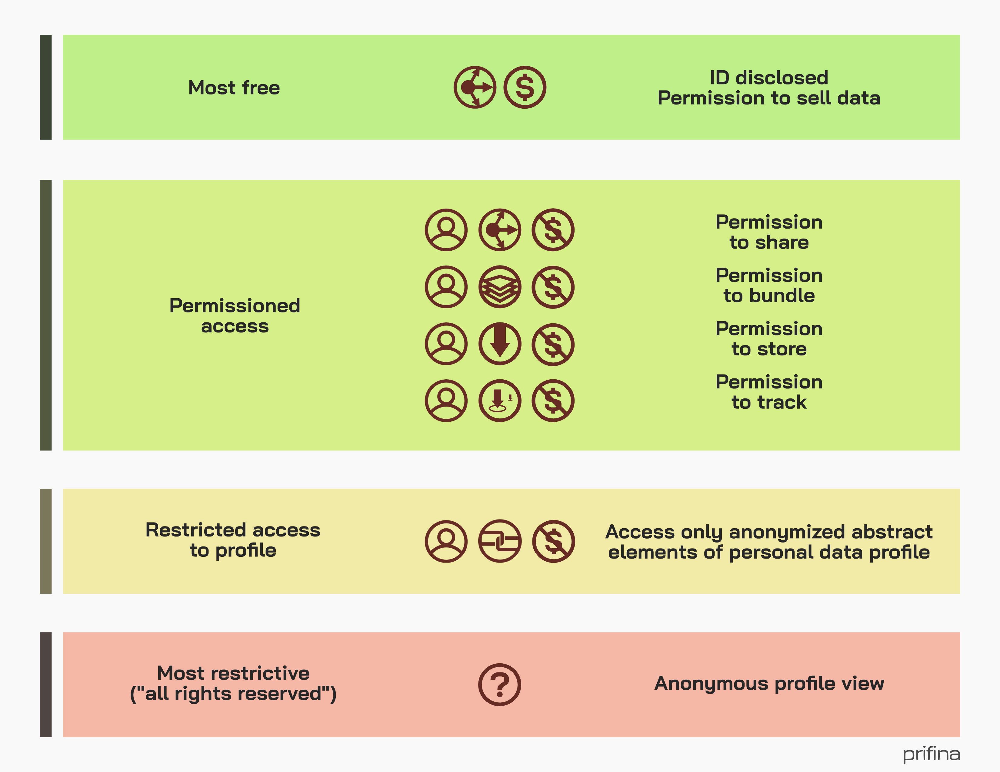

# Data-Model-GraphQL

## Project Overview

In order to bring user held data models to the world, we need to ensure data models follow commonly accepted principles, widely used customs as well as universality to be meaningful. 

This project tracks the building of a user held data model and API. It is based on benchmarks such as IAB Techlabs open standard content taxonomy and CINTs open standard taxonomy.

The user data model is used to build customized user data profiles that are accessed using GraphQL. The user makes these profiles available in exchange for customized services by giving permissioned API access, in the form of data profiles. 

Access to data profiles is always controlled by the individual by setting permissions by which access to the data profile is granted. The individual has the ability and right to manage those permissions, granting, modifying and revoking them. 

### Version Summary

This is the initial version of the API.

The current API does not enforce or include the access permissions. 

It includes some sample data to understand the data model/profile and possible use cases. 

### Permissioned Access



### Media Profile

This project demonstrates how a data profile could be accessed using the GraphQL API. For this particular profile the information made available would be useful for a media company to use to give customized recommendations to the user.

### How to Use This Project

A current version of the media profile and API is available for download and use. 

There are several use cases that are being trialed in segments such as consumer finance, media, travel, similar to this project. Creating different use cases based on this idea is encouraged. For more information and support, please get in touch at developers@prifina.com

### Dependencies

Use of this project requires Python 3 with the following dependencies installed:
```
pip install SQLAlchemy
pip install graphene_sqlalchemy
pip install Flask
pip install Flask-GraphQL
```

### File Descriptions

- models.py - python file containing database models of the media profile
- schema.py - python file which defines GraphQL graph structure for database models
- app.py - python file for running GraphQL and GraphiQL views in Flask
- database.sqlite3 - database containing dummy data for demonstration purposes
- fill_db.py - python script for putting data into database (can modify to change dummy data)

### Instructions

1. Download the files into a folder on your local computer
2. Open the command line and run: 
```
python app.py
```
3. Open http://127.0.0.1:5000/graphql in your browser
4. Use the GraphiQL interface to query the database

### Sample GraphQL Query and Response

#### Query
```
{
  allBasics {
    edges {
      node {
        id
        age
        name
        gender
        households {
          edges {
            node {
              id
              income
              numberofchildren
              numberofpersonsinhome
              maritalstatus
              accomodationtype
            }
          }
        }
        occupations {
          edges {
            node {
              id
              organization
              employeedepartment
              employeeprimaryrole
            }
          }
        }
        educations {
          edges {
            node {
              id
              highesteducation
            }
          }
        }
      }
    }
  }
}
```
#### Response
```
{
  "data": {
    "allBasics": {
      "edges": [
        {
          "node": {
            "id": "QmFzaWM6MQ==",
            "age": 34,
            "name": "Tyler",
            "gender": "male",
            "households": {
              "edges": [
                {
                  "node": {
                    "id": "SG91c2Vob2xkOjE=",
                    "income": "over 120,000",
                    "numberofchildren": 1,
                    "numberofpersonsinhome": 3,
                    "maritalstatus": "Married",
                    "accomodationtype": "Apartment"
                  }
                }
              ]
            },
            "occupations": {
              "edges": [
                {
                  "node": {
                    "id": "T2NjdXBhdGlvbjox",
                    "organization": "Prifina",
                    "employeedepartment": "Information Technology",
                    "employeeprimaryrole": "Data Analyst"
                  }
                }
              ]
            },
            "educations": {
              "edges": [
                {
                  "node": {
                    "id": "RWR1Y2F0aW9uOjE=",
                    "highesteducation": "Masters"
                  }
                }
              ]
            }
          }
        },
        {
          "node": {
            "id": "QmFzaWM6Mg==",
            "age": 55,
            "name": "Steve",
            "gender": "male",
            "households": {
              "edges": [
                {
                  "node": {
                    "id": "SG91c2Vob2xkOjI=",
                    "income": "50,000 to 60,000",
                    "numberofchildren": 2,
                    "numberofpersonsinhome": 4,
                    "maritalstatus": "Married",
                    "accomodationtype": "House"
                  }
                }
              ]
            },
            "occupations": {
              "edges": [
                {
                  "node": {
                    "id": "T2NjdXBhdGlvbjoy",
                    "organization": "Google",
                    "employeedepartment": "Marketing and Sales",
                    "employeeprimaryrole": "Sales Engineer"
                  }
                }
              ]
            },
            "educations": {
              "edges": [
                {
                  "node": {
                    "id": "RWR1Y2F0aW9uOjI=",
                    "highesteducation": "Masters"
                  }
                }
              ]
            }
          }
        }
      ]
    }
  }
}
```

